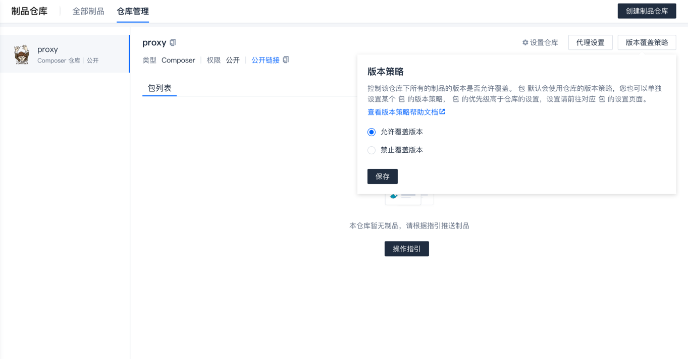
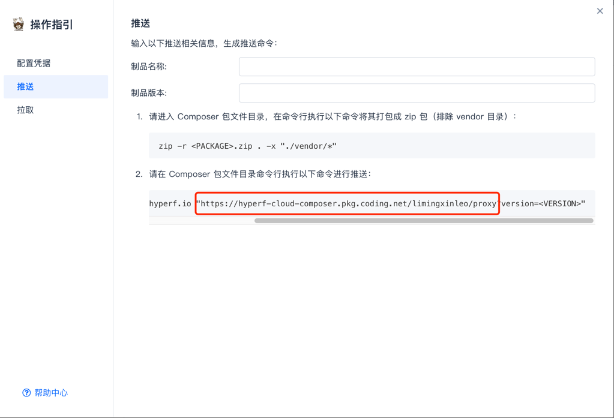

# Composer 代理

用于解决国内 `Composer` 源，不全、慢等问题。

Coding 推出了 Composer 的制品库，但其有一系列BUG，暂时使用起来并不方便，所以，本仓库基于 Github Actions 和 Coding Composer 制品库，来解决以上问题。

## 使用指南

1. 在 [Coding](https://coding.net) 注册账号，创建项目组（需要支持制品管理）
2. 创建制品仓库，选择 Composer
3. 仓库设置 - 代理设置


4. 修改版本覆盖策略



5. 点击操作指引，生成个人令牌


将以下两个数据保存下来

```
login xxx
password xxx
```

6. 分别将上述两个数据，存储到 Secrets 中，命名为

```
CODING_LOGIN
CODING_PASSWORD
```

7. 复制远端地址，将其存储到 Secrets 中。



比如，我的 URL 为以下链接

```php
CODING_URL="https://hyperf-cloud-composer.pkg.coding.net/limingxinleo/proxy"
```

8. 最后一步只需要配置对应的代理接口

```json
{
    "repositories": {
        "proxy": {
            "type": "composer",
            "url": "https://hyperf-cloud-composer.pkg.coding.net/limingxinleo/proxy",
            "only": [
                "hyperf/*"
            ]
        }
    }
}
```

